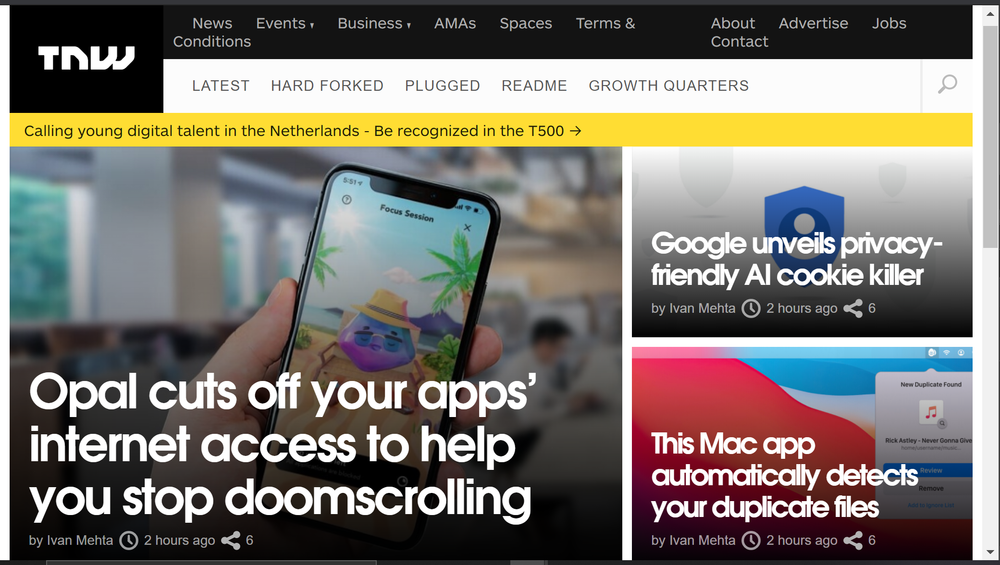

# TNW_Project

It's a TNW webpage built with HTML 5 semantic tags, CSS grid, flex, etc.

## Built With

- HTML5 AND CSS3
- Editors (VS Code), Git, Github,

## Live Demo

[Live Demo Link](https://chike1990.github.io/TNW_Project/)

## Authors

👤 **Chibuike Uzoechina**

- GitHub: [Chike](https://github.com/Chike1990)
- Twitter: [Chike](https://twitter.com/@ChibuikeUzoechi)
- LinkedIn: [Chike](https://www.linkedin.com/in/chibuike-uzoechina-630857102)

## 🤝 Contributing

Contributions, issues, and feature requests are welcome!

Feel free to check the [issues page](issues/).

## Show your support

Give a ⭐️ if you like this project!

## 📝 License

This project is [MIT](https://github.com/Chike1990/cloned_NYT/blob/master/LICENSE) licensed.
